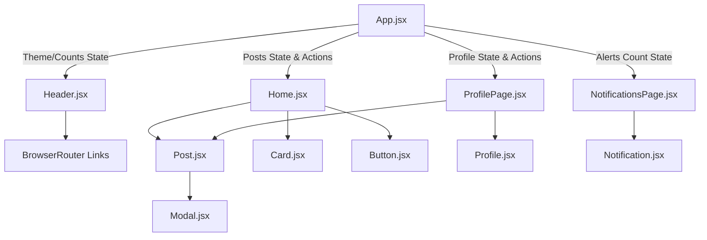

# SocialSphere - Premium React Social Media Dashboard

SocialSphere is a high-performance, single-page social media dashboard built using **React.js (v18)** and **Vite**. The application fulfills the full specifications of the modern frontend learning curriculum, showcasing robust component organization, CSS modules for scoped layouts, custom hooks, API simulation, and comprehensive unit testing.

## 🚀 Project Overview

The primary objective of SocialSphere is to design a centralized social media channel console. It enables content creators and brand managers to track channel metrics, publish updates, manage profile handles, and review alerts.

### Key Features
*   🌓 **Dynamic Theme Selector**: Switch seamlessly between futuristic Dark mode and clean Light mode.
*   🔄 **Live Post Feed**: Create, preview, like, and delete posts dynamically with real-time counters.
*   💬 **Modal-based Comment Engine**: View comments and insert new comments in overlay dialogs.
*   🔍 **Instant Filter & Search**: Search posts by text query and filter by category tags (General, Tech, Design).
*   📊 **Analytics Metrics Overview**: Track Followers, Reactions, Engagement rate, and Post count.
*   📯 **API Simulation**: Mock async data fetching, latency loaders, and network connection errors.
*   💾 **Persistent LocalStorage State**: Keep feeds, active profiles, and active themes saved between page refreshes.

---

## 🛠️ Step-by-Step Installation

Follow these steps to run the application locally on your machine:

1.  **Clone the Repository**:
    ```bash
    git clone <your-repository-url>
    cd social-media-dashboard
    ```

2.  **Install Project Dependencies**:
    ```bash
    npm install
    ```

3.  **Run Development Server**:
    ```bash
    npm run dev
    ```
    *   The server will start on **[http://localhost:3000](http://localhost:3000)**.

4.  **Run Automated Tests**:
    ```bash
    npm run test
    ```
    *   Vitest will run the unit tests suite and print test reports in the terminal.

---

## 📂 File Hierarchy

The directory structure is organized systematically to separate reusable layout assets, views, configurations, and scripts:

```text
social-media-dashboard/
├── .vscode/               # Editor configurations & launch profiles
├── public/                # Static public assets
├── src/
│   ├── components/        # Modularity components
│   │   ├── common/        # Shared core UI elements
│   │   │   ├── Button/    # Styled Button block & module CSS
│   │   │   ├── Card/      # Layout containers & module CSS
│   │   │   └── Modal/     # Action overlay Dialog & module CSS
│   │   ├── Header/        # Navbar navigation bar
│   │   ├── Notification/  # Individual notifications renderers
│   │   ├── Post/          # Post cards with action buttons
│   │   └── Profile/       # User statistics summary widget
│   ├── hooks/             # Custom React Hooks
│   │   └── useLocalStorage.js
│   ├── pages/             # View Pages
│   │   ├── Home/          # Feed posting & metrics dashboard
│   │   ├── Notifications/ # User notification logs
│   │   └── ProfilePage/   # Profile settings editing forms
│   ├── styles/            # Central design tokens
│   │   └── variables.css  # Dynamic light/dark styling vars
│   ├── App.jsx            # Main app router wrapper
│   ├── index.css          # Base CSS settings
│   └── main.jsx           # App entry mounting script
├── tests/                 # Testing directory
│   ├── setup.js           # Test environments loader
│   └── Post.test.jsx      # Unit test specifications
├── package.json           # Scripts and package manifests
├── vite.config.js         # Bundler and compiler configs
└── README.md              # Project documentation
```

---

## 🗺️ Component Architecture & Data Flow



### Data Flow Principles
1.  **State Up-lifting**: Central states like `posts`, `profile`, and `theme` reside in `App.jsx` to synchronize across sections.
2.  **Custom Hooks**: Component states automatically write to `localStorage` via the `useLocalStorage` hook, keeping operations persistent.
3.  **Scoped Styling**: Individual elements load independent styles via **CSS Modules** (`*.module.css`), ensuring no class namespace clashes.

---

## 🧪 Testing Evidence

Automated tests are implemented using **Vitest** and **React Testing Library** to validate unit behaviors.

### Run Suite
```bash
npm run test
```

### Test Case Coverage
The `tests/Post.test.jsx` test suite asserts:
1.  **Initial Render**: Confirms that post authors, body text, and platform categories load and show in the document.
2.  **Interactive Liking**: Validates that clicking the Like action increments likes by 1, colors the heart icon, triggers the callback, and toggles back to original counts when clicked again.

---

## 📸 Screenshots Guidance

Insert screenshots displaying these states in this section:

*   **Desktop Dashboard View**: *(Add `/public/screenshots/desktop_dashboard.png`)*
*   **Mobile Dashboard View**: *(Add `/public/screenshots/mobile_dashboard.png`)*
*   **Notifications View**: *(Add `/public/screenshots/notifications.png`)*
*   **Light Mode Toggle**: *(Add `/public/screenshots/light_mode.png`)*
